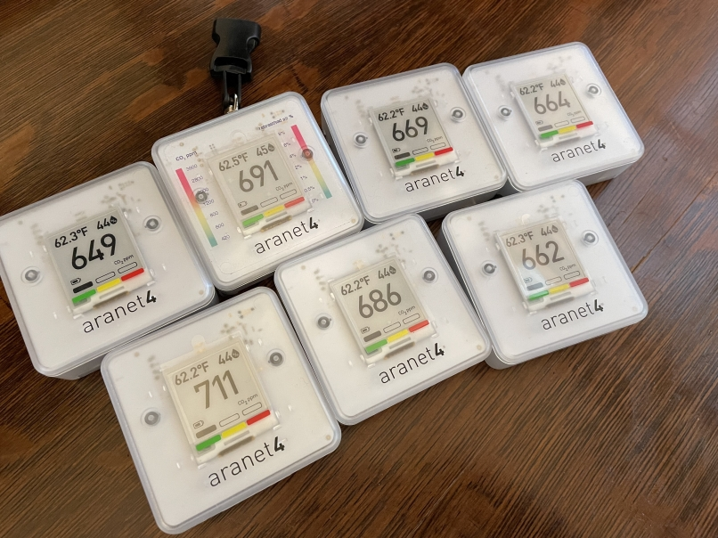
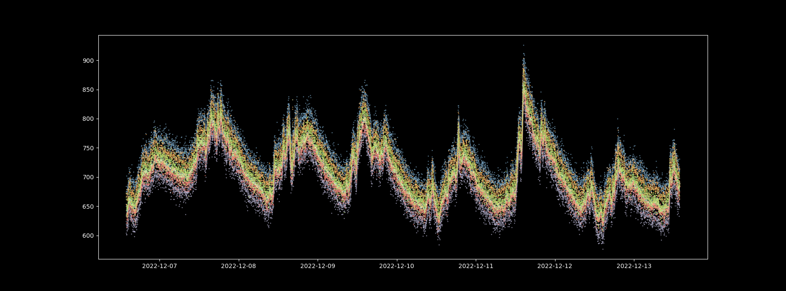
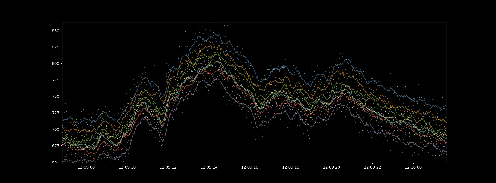
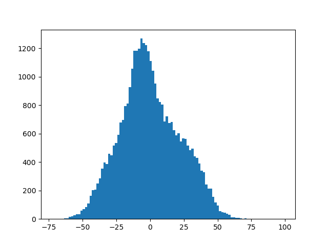
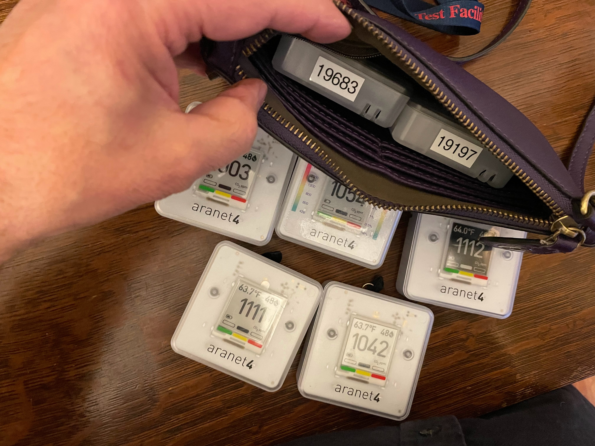
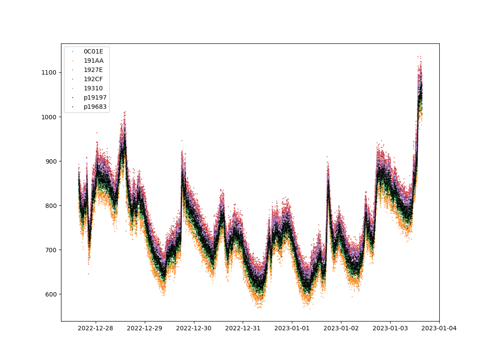
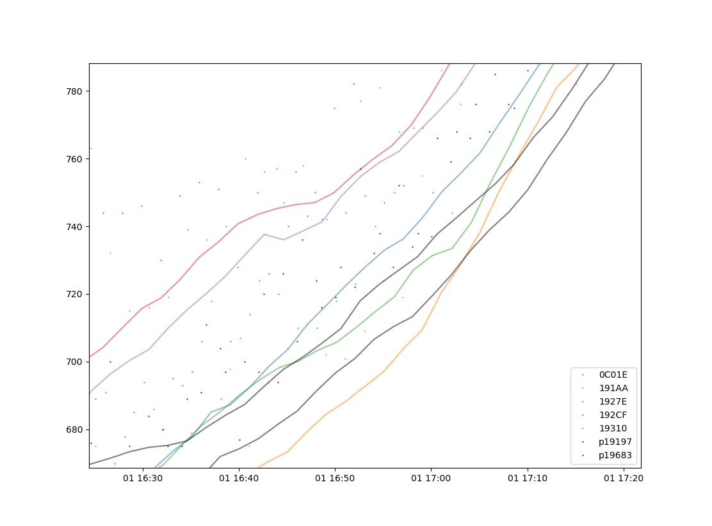

# How reliable are my Aranet4 CO2 sensor measurements?

## Experiment 1: Seven sensors for seven days
- Measure a residential hallway, with all sensors exposed to the same indoor air in parallel.  The number of people and pets in the house varied over time. There was occasional gas-flame cooking in a neighboring room.  Most activity did not occur in direct proximity to the sensors.
- Device settings:
    - Sensor hardware `rev 12`
    - Firmware `v0.4.14`
    - Measurement interval: `2 minutes`
- After seven days, downloaded `.csv` files from all seven sensors using Aranet4 app.
- Raw data is [here](data/week2)

## Let's plot a week of data

`$ python plot.py data/week2/*.csv`

A zoomed-in section of this plot shows a 10-point (20 minute) moving average superimposed onto the individually measured points. It can be seen at a glance that measurements between different sensors vary from each other between zero and 100 ppm.

What is the rolling standard deviation for each sensor with respect to its own 10-point moving average? 

 Standard deviation of each sensor around its 10-point mean is typically around 10 ppm.

 ## Combining all the data

 How much do readings vary between all sensors?  If we take the difference between each reading and the global moving average across all sensors at that time, we get a distribution of differences like this:

 

The standard deviation of these differences is ~22 ppm.  If it were a normal distribution that would imply approximately 95% of readings are consistent within +/- `44 ppm`

## Quartiles:

    >>> np.quantile(diffs, [0, 0.25, 0.5, 0.75, 1]))
    [-72.3, -14.7, -1.9, 15.2, 98.9]

Half the measurements were consistent within +/- `15 ppm`

## Quantiles covering 95%:

    >>> np.quantile(diffs, [0, 0.025, 0.975, 1]))
    [-72.3, -40.9, 43.8, 98.9]

## Conclusion from Experiment 1

Roughly 95% of measurements were consistent within +/- `40 ppm`

# Experiment 2: Small leather purse
The purse was kept by the 5 other sensors.  It had a large zipper which was kept tightly closed for the duration of the data collection period.

In the figure below, the two sensors zipped up in a purse are colored black, and it can be seen that overall, their measurements track right alongside the other five sensors.

Zooming in to a section of the the data where CO2 levels were rising rapidly, it can be seen that the two black moving-average lines lag behind most of the other sensors.

## Conclusion from Experiment 2

Keeping these CO2 sensors in a leather purse does not prevent them from measuring accurately.  It can, however, delay the measurements from anywhere between 0 and 10 minutes.

# Feedback?
Do these conclusions seem reasonable?  Please check the data and the code, and let me know in an issue.
