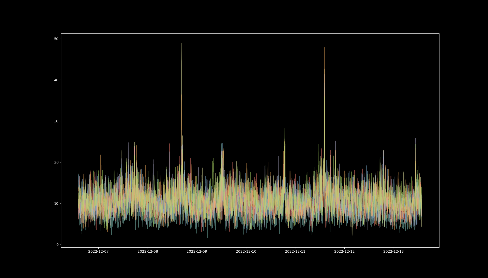

# How reliable are my Aranet4 CO2 sensor measurements?

## Seven sensors for seven days
- Measure a residential hallway, with all sensors exposed to the same indoor air in parallel.  The number of people and pets in the house varied over time. There was occasional gas-flame cooking in a neighboring room.  Most activity did not occur in direct proximity to the sensors.
- Device settings:
    - Sensor hardware `rev 12`
    - Firmware `v0.4.14`
    - Measurement interval: `2 minutes`
- After seven days, downloaded `.csv` files from all seven sensors using Aranet4 app.
- Raw data is [here](data/week2)

## Let's plot a week of data

`$ python plot.py data/week2/*.csv`

A zoomed-in section of this plot shows a 10-point (20 minute) moving average superimposed onto the individually measured points. It can be seen at a glance that measurements between different sensors vary from each other between zero and 100 ppm.

What is the rolling standard deviation for each sensor with respect to its own 10-point moving average? 

 Standard deviation of each sensor around its 10-point mean is typically around 10 ppm.

 ## Combining all the data

 How much do readings vary between all sensors?  If we take the difference between each reading and the global moving average across all sensors at that time, we get a distribution of differences like this:

 

The standard deviation of these differences is ~22 ppm.  If it were a normal distribution that would imply approximately 95% of readings are consistent within +/- `44 ppm`

## Quartiles:

    >>> np.quantile(diffs, [0, 0.25, 0.5, 0.75, 1]))
    [-72.3, -14.7, -1.9, 15.2, 98.9]

Half the measurements were consistent within +/- `15 ppm`

## Quantiles covering 95%:

    >>> np.quantile(diffs, [0, 0.025, 0.975, 1]))
    [-72.3, -40.9, 43.8, 98.9]

## Conclusion

Roughly 95% of measurements were consistent within +/- `40 ppm`

## Feedback?
Does this conclusion seem reasonable?  Check the data and the code and let me know.
